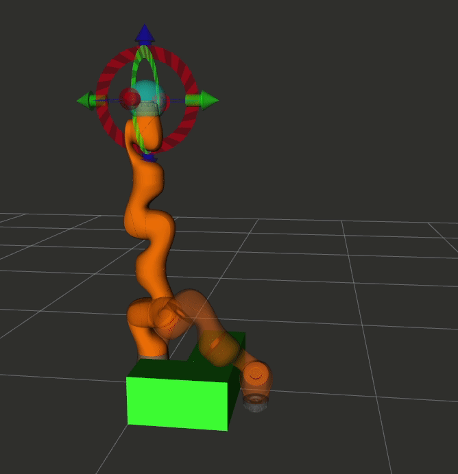
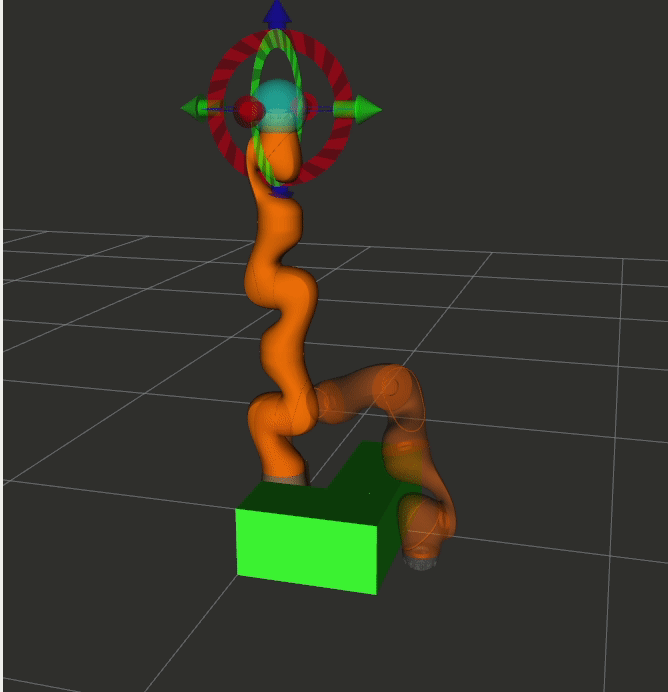
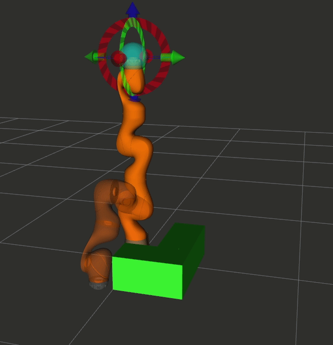
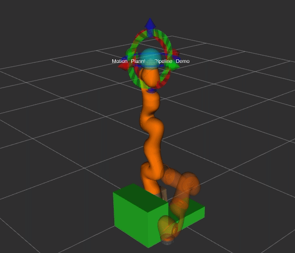

# iiwa_moveit_demo Package

## Demonstrations

### Demo 1
  Plan trajectories with **collision objects**.  
  [source code](./src/moveit_demo_1_node.cpp)

  Run demo using:
  ```
  roslaunch iiwa_moveit_demo moveit_demo_1.launch 
  ```

  then press the Next button in the RvizVisualToolGui

  

### Demo 2
  Build upon _Demo 1_, and **plan the trajectories with constraints** ([Ref](https://ros-planning.github.io/moveit_tutorials/doc/planning_with_approximated_constraint_manifolds/planning_with_approximated_constraint_manifolds_tutorial.html))  
  [source code](./src/moveit_demo_1_node.cpp)

  Run demo using:
  ```
  roslaunch iiwa_moveit_demo moveit_demo_2.launch 
  ```
  


## Demo 3
  Build upon _Demo 2_, add **end effector orientation constraints**. call the following function in the [source code](./src/moveit_demo_3_node.cpp)  
  ```cpp
  addPathConstraints(move_group_interface);
  ```

  Run demo using:
  ```
  roslaunch iiwa_moveit_demo moveit_demo_3.launch 
  ```

  


## Demo 4
  Plan trajectories with **collision objects**, using _Planning Pipeline_.  
  [source code](./src/moveit_demo_4_node.cpp)  


  Run demo using:
  ```
  roslaunch iiwa_moveit_demo moveit_demo_4.launch 
  ```

  

## Deprecated Method

### Using planning_interface::PlanningContext

  This method is not able to avoid obstacles  
  [source code](./src/deprecated/deprecated_demo_2_node.cpp)  


## Dependencies
- [iiwa_moveit_cam](https://github.com/RROS-Lab/iiwa_cam)
  